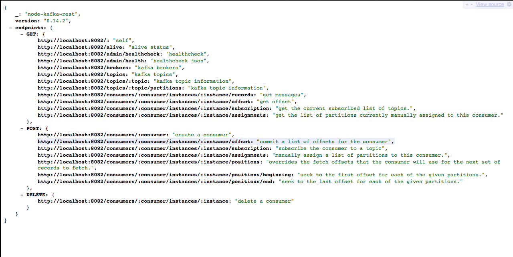
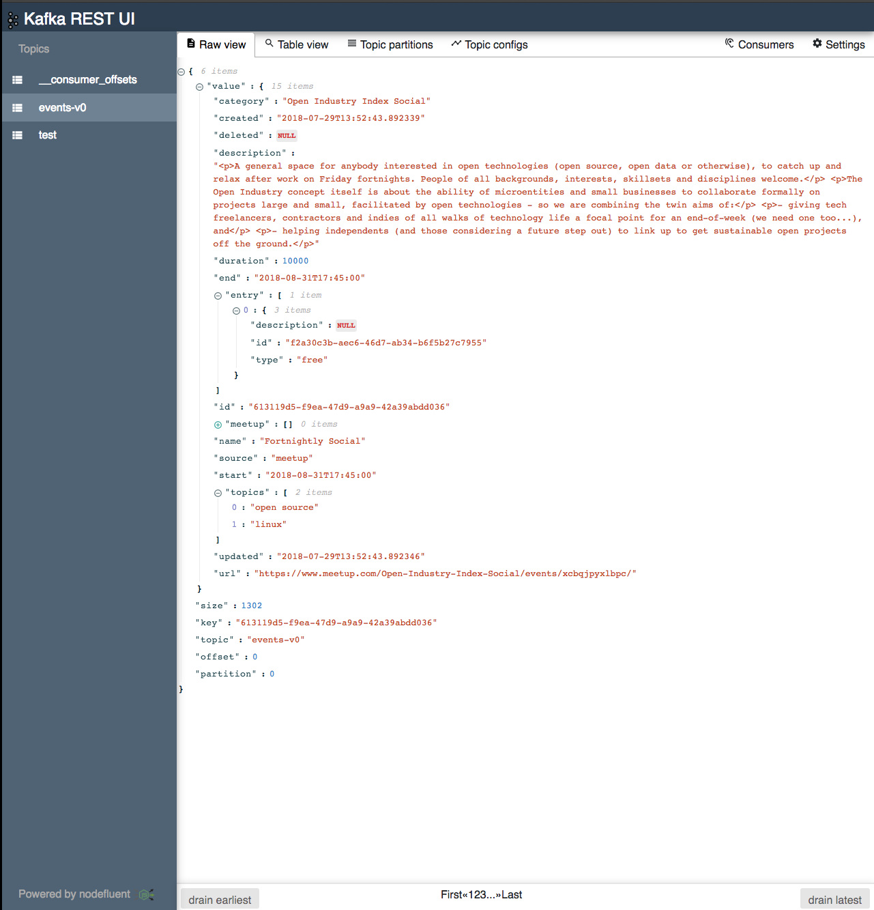
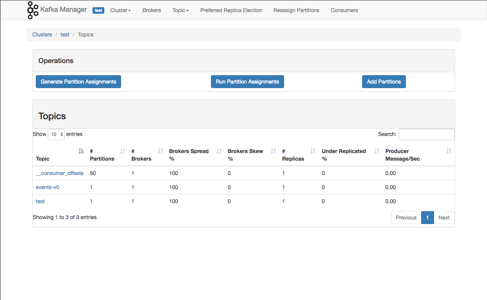

Kafka By Example
================

Hey there! This is Kafka by Example! This tutorial is for you if you've got some programming experience and if you're not too familiar with Kafka (v0.10.2.1). It can still be useful if already experienced with Kafka, as this tutorial provides a local development environment before proceeding into more and more advanced topics.

Examples of use cases include reporting data to Kafka from any frontend app built in any language, ingesting messages into a stream processing framework that doesn't yet support Kafka, and scripting administrative actions.

If you want to contact me, check out my twitter account, find me on #apoclyps.

#### Prerequisites

-	[Docker](https://www.docker.com/)
-	[Python 3.7](https://www.python.org/downloads/release/python-370/)

#### Quickstart

The following assumes you have ZooKeeper, Kafka, and an instance of the REST Proxy running using the default settings and some topics defined and created within `docker-compose.yml`. To create an instance of all of these services, run the following command.

```sh
$ docker-compose up --build kafka kafka-rest kafka-rest-ui kafka-manager rest-gateway
```

-	ZooKeeper will be available on `http://localhost:2181`
-	Kafka will be available on `http://localhost:9092`
-	Kafka REST will be available on `http://localhost:8083`
-	Kafka UI will be available on `http://localhost:8000` and it makes use of another implementation of the REST API on `http://localhost:8082`.
-	Kafka Manager will be available on `http://localhost:9000`

#### So What's Kafka?

> Apache Kafka is an open-source stream-processing software platform developed by the Apache Software Foundation, written in Scala and Java. The project aims to provide a unified, high-throughput, low-latency platform for handling real-time data feeds.

It can be a little tricky getting started with Kafka as it requires some setup and configuration however this projects hopes to abstract away as much of the complexity as possible. However you may come across the following terms so let's explain what they are before we get started:

##### ZooKeeper

> ZooKeeper is a centralized service for maintaining configuration information, naming, providing distributed synchronization, and providing group services. All of these kinds of services are used in some form or another by distributed applications.

ZookKeeper helps manage Kafka. In this tutorial we will only be running a single instance of Kafka however much larger systems may have 10s, 100s, or evens 1000s of brokers that need to be managed. This is where ZooKeeper really helps!

##### Kafka REST

> The Kafka REST Proxy provides a RESTful interface to a Kafka cluster. It makes it easy to produce and consume messages, view the state of the cluster, and perform administrative actions without using the native Kafka protocol or clients.

Typically a REST API for Kafka won't be exposed in this way however for the purposes of learning it helps reduce some of the complexity of getting data into Kafka for first-time users. It also has the added benefit of allowing a REST UI to sit on top of Kafka to provide some insights and visualizations of data.



##### Kafka REST UI

> Kafka-Rest-UI is a Kafka topics browser. It provides the ability to view Kafka topics, view topic metadata, browse Kafka messages (with offline storage), filter Kafka messages, view topic configuration, and view consumers status.

Distributed services, stream-processing, and real-time data streams can be a lot to learn at once. Removing the initial dependency on using an API or Client greatly reduces the effort it takes to learn about Kafka and begin building interesting applications.



##### Kafka Manager

> Kafka-Manager GUI application for managing and using Apache Kafka clusters. It provides an intuitive UI that allows one to quickly view objects within a Kafka cluster as well as the messages stored in the topics of the cluster. It contains features geared towards both developers and administrators.



### Tutorials

-	[Configure Kafka Manager](docs/configure_kafka_manager.md)
-	[Using Kafka Rest](docs/using_kafka_rest.md)
-	[Producing and Consuming Data](docs/producing_and_consuming_data.md)

#### Adapted from the following resources:

-	Zookeeper Docker: https://github.com/wurstmeister/zookeeper-docker
-	Kafka Docker: https://github.com/wurstmeister/kafka-docker
-	Kafka Rest: https://github.com/nodefluent/kafka-rest-ui
-	Kafka Rest UI: https://github.com/nodefluent/kafka-rest-ui

#### Useful Learning Resources

https://blog.parse.ly/post/3886/pykafka-now/
